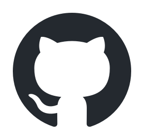

Yongseok Choi ⎯ Portfolio

> Mobile: 010-4207-3122  
> E-mail: clyksb0731@gmail.com

- 개인 프로젝트

1. 집家

> 열심히 일한 당신, 이제는 퇴근 할 때!  
> 무의미한 업무 연장은 이제 그만! 집중적으로 일하고 신나게 퇴근하자!  
> 이제 퇴근시간은 잊어버리세요. 지금부터 '집家'가 알려드립니다.  

[더보기..](https://clyksb0731.github.io/portfolio/zipga)

    
    

    
    
    

- 경력사항

2019. 10 ~ 재직 중

1. SmartSee Cloud

2. 스마트 의료지도

3. 응급전원협진망

2018. 10 ~ 2019. 9

1. MeDNA Record

2. Tcurity

3. LiveCert

- 기타

