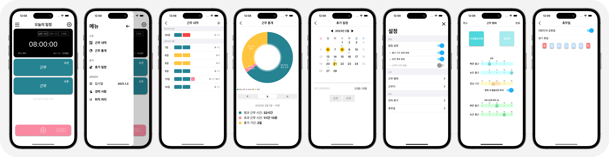

Yongseok Choi ⎯ Portfolio

경력전환을 통해 끝내 꿈을 이루어 신명나게 개발하고 있는 iOS 앱 개발자 **최용석**입니다. 

## Contact
> Mobile: 010-4207-3122  
> E-mail: clyksb0731@gmail.com

- 업무 프로젝트

2019. 10 ~ 재직 중 (비앤피이노베이션)

1. SmartSee Cloud

2. 스마트 의료지도

3. 응급전원협진망

4. In-House 배포 앱

1) Smart TBM (포스코)

2) 쪼끼 매니저 앱 (포스코)

2018. 10 ~ 2019. 9 (와임)

1. MeDNA Record

2. Tcurity

3. LiveCert

- 개인 프로젝트

1. 집家

> 열심히 일한 당신, 이제는 퇴근 할 때!  
> 무의미한 업무 연장은 이제 그만! 집중적으로 일하고 신나게 퇴근하자!  
> 이제 퇴근시간은 잊어버리세요. 지금부터 '집家'가 알려드립니다.  

**# 앱 설명**  
- 근무 일정을 설정하면 퇴근을 미리미리 알려줍니다.  
- 근무 내역을 기록할 수 있고 주/월/년 단위로 근무 통계를 볼 수 있습니다.  
- 휴가 일정을 관리할 수 있으며 일정에 대한민국 공휴일을 적용할 수 있습니다.
- 경력도 관리해 줍니다.
- 현재 App Store에 배포되어있습니다.

    <a href="https://clyksb0731.github.io/portfolio/zipga">앱 정보 더보기..</a>

**# 개발 정보**
- 개발언어: Swift
- 개발스택: UIKit, AutoLayout, Realm, Alamofire, Charts
- 소스관리: Git, Github

    
    
    

  

2. 마이스몰트립

> 사진 찍고 오는 여행 No!! 발자국만 찍고 돌고 오는 여행 No!!  
> 진정한 여행이란? 현지를 느끼고 오는 것!!!  
> 현지 여행의 모든 것을 담은 마이리얼트립의 작은 버전. My Small Trip 입니다.

**앱 설명**
- 마이리얼트립(현재 여행 중개 서비스)의 Small Version  
- Fast Campus 팀 프로젝트로서 [`마이리얼트립`](https://www.myrealtrip.com)의 리뉴얼 앱입니다.

**개발 정보**
- 개발언어: Swift
- 개발스택: UIKit, AutoLayout, Alamofire
- 소스관리: Git, Github

    
    

  

- 기타

