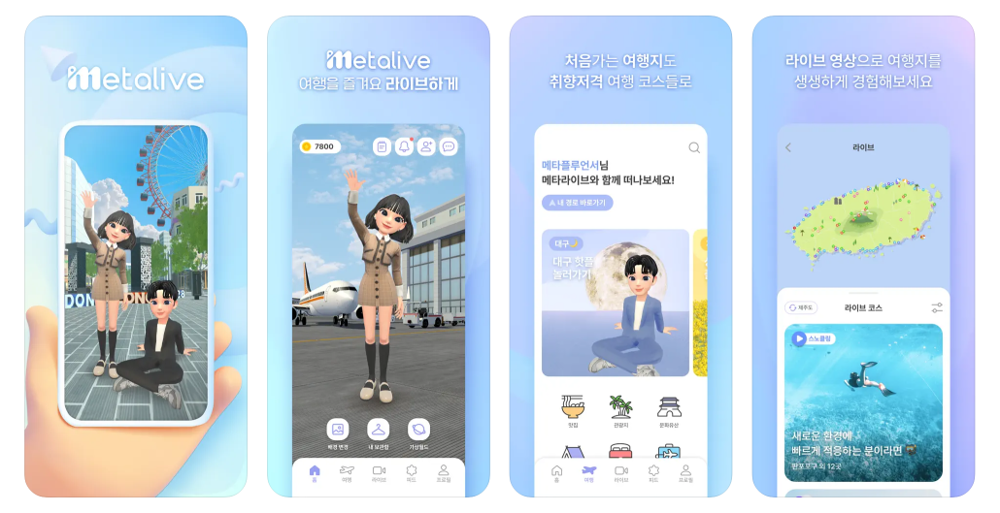
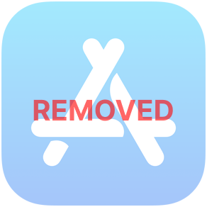

Yongseok Choi ⎯ Portfolio

 

    

        

            

                
            

            

                exciting Swift, excited iOS developer.
            

            

                I am <b>Yongseok Choi</b>, an iOS app developer who has become a developer through a career transition and is developing apps with great enthusiasm
            

        

    

    

        

            <a href="#careers">Careers</a> 
        

        <ul>
            <li><b>Apr. 2023 ~ Feb. 2024</b> | Awesomepia
                <ul style="list-style:none;padding-left:0px;padding-bottom:16px">
                    <li>1. Metalive</li>
                </ul>
            </li>
            <li><b>Oct. 2019 ~ Mar. 2023</b> | BNP Innovation
                <ul style="list-style:none;padding-left:0px;padding-bottom:16px">
                    <li>1. Smart Advanced Life Support</li>
                    <li>2. Remote Emergency Consultation System</li>
                    <li>3. SmartSee Cloud</li>
                    <li>4. In-House Apps
                        <ul style="list-style:none;padding-left:16px">
                        <li>A. Smart TBM (POSCO)</li>
                        <li>B. Jacket Manager (POSCO)</li>
                        </ul>
                    </li>
                </ul>
            </li>
            <li><b>Oct. 2018 ~ Sep. 2019</b> | WAEM
                <ul style="list-style:none;padding-left:0px">
                    <li>1. MeDNA Record</li>
                    <li>2. Tcurity</li>
                    <li>3. LiveCert</li>
                </ul>
            </li>
        </ul>
        

            <a href="#personal_projects">Personal Projects</a>
        

        <ul>
            <li>Time to Go Home (ZipGa)</li>
            <li>My Small Trip (Clone Project as a term project)</li>
        </ul>
    

    Tech Stack

<code>Swift</code> <code>Objective-C</code> <code>UIKit</code> <code>Storyboard</code> <code>AutoLayout</code> <code>Realm</code> <code>CallKit</code> <code>PushKit</code> <code>Remote Push</code> <code>Alamofire</code> <code>AFNetworking</code> <code>RESTFult API</code> <code>Charts</code> <code>Kingfisher</code> <code>iBeacon</code> <code>BLE</code> <code>Rabbit MQ</code> <code>Git</code> <code>Github</code> <code>Bitbucket</code>

    Contact

<blockquote>
    

        GitHub: https://github.com/clyksb0731 
        E-mail: clyksb0731@gmail.com
    

</blockquote>

    <a id="careers">- Careers</a>

    Apr. 2023 ~ Feb. 2024 
    @ Awesomepia: Seoul&nbsp; |&nbsp; iOS App Developer

    1. Metalive 
    

<blockquote>
    

        Customized travel itinerary, Virtual tour design, Introduction of recommended tourist destinations
    

</blockquote>

<b># App Icon</b>

    

  

<b># Development Info.</b>
<ul>
    <li>Language: Swift</li>
    <li>Tech Stack: UIKit, AutoLayout, Storyboard, Remote Push, Alamofire, RESTful API, Kingfisher</li>
    <li>SCM: Git, Github</li>
</ul> 

    

  

    Oct. 2019 ~ Mar. 2023 
    @ BNP Innovation: Seoul&nbsp; |&nbsp; iOS App Developer

    1. Smart Advanced Life Support 
    

<blockquote>
    

        Smart medical guidance project targeting cardiac arrest patients
    

</blockquote>

<b># App Icon</b>

    

  

<b># Development Info.</b>
<ul>
    <li>Language: Objective-C</li>
    <li>Tech Stack: UIKit, AutoLayout, Storyboard, CallKit, PushKit, Remote Push, AFNetworking, RESTful API</li>
    <li>SCM: Git, Bitbucket</li>
</ul> 

    

  

    2. Remote Emergency Consultation System 
    

<blockquote>
    

        In order to improve the quality of medical care in areas vulnerable to emergency medical care, specialists residing at major hospitals in large cities provide remote support for emergency patient care
    

</blockquote>

<b># App Icon</b>

    

<b># Development Info.</b>
<ul>
    <li>Language: Objective-C</li>
    <li>Tech Stack: UIKit, AutoLayout, Storyboard, AFNetworking, RESTful API, Remote Push</li>
    <li>SCM: Git, Bitbucket</li>
</ul>

    

  

    3. SmartSee Cloud 
    

  

<blockquote>
    

        An integrated industrial safety management platform that applies various cutting-edge technologies, such as self-safety rule compliance management, risk notification, and rescue requests by field workers
    

</blockquote>

<b># App Icon</b>

    

  

<b># Development Info.</b>
<ul>
    <li>Language: Objective-C</li>
    <li>Tech Stack: UIKit, AutoLayout, Storyboard, CallKit, PushKit, Remote Push, AFNetworking, RESTful API, iBeacon, Rabbit MQ</li>
    <li>SCM: Git, Bitbucket</li>
</ul>

    

  

    4. In-House Apps

    A. Smart TBM (POSCO)

<h4 style="color:red"><i>* No Images because distributed by In-House</i></h4>
<blockquote>
    TBM(Tool Box Meeting): An activity in which employees discover potential risk factors related to work content and equipment in advance and implement safety measures before starting work, with the goal of creating a safe work environment
</blockquote>

<b># Development Info.</b>
<ul>
    <li>Language: Swift</li>
    <li>Tech Stack: UIKit, AutoLayout, Alamofire, RESTful API</li>
    <li>SCM: Git</li>
</ul>

    B. Jacket Manger (POSCO)

<h4 style="color:red"><i>* No Images because distributed by In-House</i></h4>
<blockquote>
    This is an app that communicates with a smart safety jacket based on the Android system via BLE. By connecting to a smart safety jacket, you can change the jacket operation settings, such as selecting a communication method and changing the video quality  
</blockquote>

<b># Development Info</b>
<ul>
    <li>Language: Swift</li>
    <li>Tech Stack: UIKit, AutoLayout, Alamofire, RESTful API, BLE</li>
    <li>SCM: Git, Bitbucket</li>
</ul>

    Oct. 2018 ~ Sep. 2019 
    @ WAEM: Seoul&nbsp; |&nbsp; iOS App Developer

    1. MeDNA Record 
    

<blockquote>
    

        MeDNA acts as a compass to help you predict and proactively prevent diseases that may occur in the future by comparing the results of genetic disease prediction tests with your health checkup results and improving your living environment to prevent diseases from being passed down in your family
    

</blockquote>

<b># App Icon</b>

    

<b># Development Info.</b>
<ul>
    <li>Language: Swift</li>
    <li>Tech Stack: UIKit, AutoLayout, Storyboard, Realm, Alamofire, RESTful API, Remote Push</li>
    <li>SCM: SVN</li>
</ul>

    

  

    2. Tcurity 
    

<blockquote>
    

        Tcurity splits data and stores them in two or more locations and all security approvers must approve for restoration  
        An in-house project not distributed on App Store
    

</blockquote>

<b># Develpment Info.</b>
<ul>
    <li>Language: Swift</li>
    <li>Tech Stack: UIKit, AutoLayout, Storyboard, Realm, Alamofire, RESTful API, Remote Push</li>
    <li>SCM: SVN</li>
</ul>

    3. LiveCert 
    

<b># App Icon</b>

    

<blockquote>
    

        Login Link, Real-time login/logout, Account Lock, Login history management
    

</blockquote>

<b># Development Info.</b>
<ul>
    <li>Language: Swift</li>
    <li>Tech Stack: UIKit, AutoLayout, Storyboard, Realm, Alamofire, RESTful API, Remote Push</li>
    <li>SCM: SVN</li>
</ul>

    

  

    <a id="personal_projects">- Personal Projects</a>

    1. Time to Go Home (ZipGa) 
    

<blockquote>
    

        You've worked hard, now it's time to leave work! 
        No more pointless overtime - work focused and leave excited!  
        Forget about quitting time. From now on, 'Time to Go Home' will tell you.
    

</blockquote>

<b># App Icon</b>

    

<b># Description</b>
<ul>
    <li>Setting a work schedule lets you know in advance when you'll be leaving work</li>
    <li>You can record your work history and view work statistics by week/month/year</li>
    <li>You can manage your vacation schedule and apply Korean public holidays to your schedule</li>
    <li>You can manage your career</li>
</ul>
<ul style="list-style:none">
    <li>
        <a href="https://clyksb0731.github.io/portfolio/zipga">
            <b>More... (Korean)</b>
        </a>
    </li>
</ul> 

<b># Development Info.</b>
<ul>
    <li>Language: Swift</li>
    <li>Tech Stack: UIKit, AutoLayout, Realm, Alamofire, RESTful API, Charts</li>
    <li>SCM: Git, Github</li>
</ul>

    
    
    

  

    2. My Smal Trip (A clone project as a term project) 
    

<b># Description</b>
<ul>
    A team project refering to <a href="https://www.myrealtrip.com">MyRealTrip</a> in Fast Campus
</ul>

<b># Development Info.</b>
<ul>
    <li>Language: Swift</li>
    <li>Tech Stack: UIKit, AutoLayout, Alamofire, RESTful API</li>
    <li>SCM: Git, Github</li>
</ul>

    
    

  

