

Yongseok Choi ⎯ Portfolio

 

    

        

            
        

        

            exciting Swift, excited iOS developer.
        

        

            커리어 전환을 통해 끝내 꿈을 이루어 
            신나게 개발하고 있는 iOS 앱 개발자 <b>최용석</b>입니다.
        

    

    

        <a href="#careers">Careers</a> 
        <ul>
            <li>2019. 10 ~ 재직 중 | <b>비앤피이노베이션</b>
                <ul style="list-style:none;padding-left:0px;padding-bottom:16px">
                    <li>1. SmartSee Cloud</li>
                    <li>2. 스마트 의료지도</li>
                    <li>3. 응급전원협진망</li>
                    <li>4. In-House 배포 앱
                        <ul style="list-style:none;padding-left:16px">
                        <li>1)Smart TBM (포스코)</li>
                        <li>2)조끼 매니저 (포스코)</li>
                        </ul>
                    </li>
                </ul>
            </li>
            <li>2018. 10 ~ 2019. 9 | <b>와임</b>
                <ul style="list-style:none;padding-left:0px">
                    <li>1. MeDNA Record</li>
                    <li>2. Tcurity</li>
                    <li>3. LiveCert</li>
                </ul>
            </li>
        </ul>
        <a href="#personal_projects">Personal Projects</a>
        <ol>
            <li>집家 (집가)</li>
            <li>마이스몰트립</li>
        </ol>
        <a href="#etc">기타</a>
        <ol>
            <li></li>
        </ol>
    

  

    기술 스택

<code>Swift</code> <code>Objective-C</code> <code>UIKit</code> <code>Storyboard</code> <code>AutoLayout</code> <code>Realm</code> <code>CallKit</code> <code>PushKit</code> <code>Remote Push</code> <code>Alamofire</code> <code>AFNetworking</code> <code>RESTFult API</code> <code>iBeacon</code> <code>BLE</code> <code>Rabbit MQ</code> <code>Git</code> <code>Github</code> <code>Bitbucket</code>

    Contact

<blockquote>
    

        Mobile: 010-4207-3122 
        E-mail: clyksb0731@gmail.com
    

</blockquote>

    <a id="careers">- Careers</a>

    2019. 10 ~ 재직 중 @ 비앤피이노베이션&nbsp; |&nbsp; iOS 앱 개발

    1. SmartSee Cloud 
    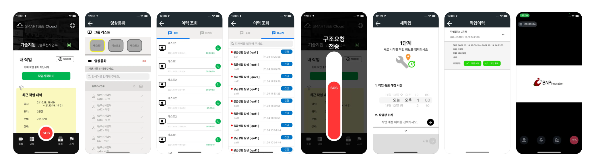

  

<blockquote>
    

        SMARTSEE CLOUD는 중대재해처벌법 대응을 위한 기업의 안전조치 강화 솔루션으로 산업재해 없는 안전한 사회 구현을 목표로 합니다. 
        현장 근로자의 셀프 안전수칙 준수관리, 위험 알림, 구조요청등 다양한 최신 기술을 적용하여 CCTV 모니터링에 의존하던 기존 산업 안전 모니터링의 한계점을 개선한 산업안전 통합 관리 플랫폼입니다.
    

</blockquote>

<b># 앱 아이콘</b>

    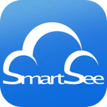

  

<b># 앱 설명</b>
<ul>
    <li>비대면 원격 현장 지원 (영상 통화)</li>
    <li>현장 영상 저장 관리</li>
    <li>작업자 위험 감지 및 구조요청</li>
    <li>위치 정보 및 구역별 안전수칙 관리</li>
    <li>App Store 배포</li>
</ul> 

<b># 개발 정보</b>
<ul>
    <li>개발언어: Objective-C</li>
    <li>개발스택: UIKit, Storyboard, AutoLayout, CallKit, PushKit, Remote Push, AFNetworking, RESTful API, iBeacon, Rabbit MQ</li>
    <li>소스관리: Git, Bitbucket</li>
</ul>

    

  

    2. 스마트 의료지도 
    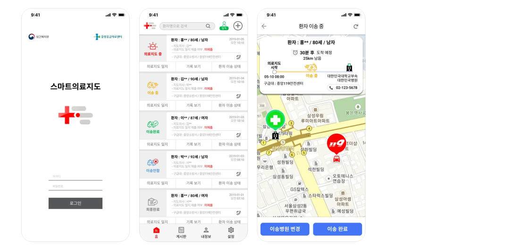

<blockquote>
    

        스마트의료지도는 심정지환자를 대상으로 하는 스마트의료지도 사업을 위한 어플리케이션 입니다. 
        스마트의료지도는 심정지환자 발생 시 119구급대가 출동하면 응급의료센터 의사가 직접 영상으로 구급대를 지도하고, 이에 따라 구급대원이 적극적인 의학적 처치를 실시하여 응급환자의 생존율 향상을 목적으로 시행 중인 사업으로, 지정된 사업지역에서만 제한적으로 사용이 가능합니다.
    

</blockquote>

<b># 앱 아이콘</b>

    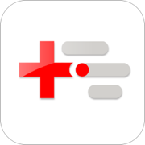

  

<b># 앱 설명</b>
<ul>
    <li>의료지도 요청 수락</li>
    <li>구급대원과 실시간 영상통화</li>
    <li>실시간 환자 처치 기록 확인</li>
    <li>응급환자 이송상태 확인</li>
    <li>의료지도 일지 작성</li>
    <li>In-House 배포 (~2023. 2)</li>
    <li>App Store 배포 (2023. 2)</li>
</ul> 

<b># 개발 정보</b>
<ul>
    <li>개발언어: Objective-C</li>
    <li>UIKit, Storyboard, AutoLayout, AFNetworking, RESTful API, CallKit, PushKit, Remote Push</li>
    <li>Git, Bitbucket</li>
</ul> 

    

  

    3. 응급전원협진망 
    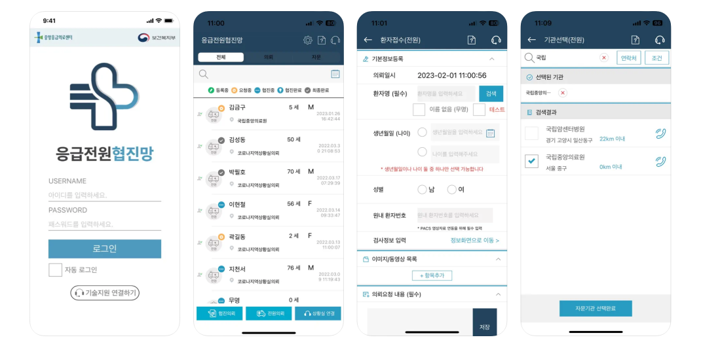

<blockquote>
    

        응급전원협진망은 응급의료 취약지의 의료 질적 수준 향상을 위해서 대도시 거점병원에 상주하는 전문의가 응급환자 진료를 원격으로 지원하는 협진 기능을 제공하기 위해 개발된 국립중앙의료원 중앙응급의료센터의 모바일 애플리케이션입니다.
    

</blockquote>

<b># 앱 아이콘</b>

    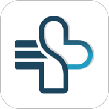

<b># 앱 설명</b>
<ul>
    <li>응급환자 협진 요청/수락</li>
    <li>영상 및 이미지 정보 등록/조회</li>
    <li>응급환자 전원 요청/수락</li>
    <li>의료기관 간 영상통화</li>
    <li>상황실 연결</li>
    <li>In-House 배포 (~2023. 2)</li>
    <li>App Store 배포 (2023. 2)</li>
</ul>

<b># 개발 정보</b>
<ul>
    <li>개발언어: Objective-C</li>
    <li>UIKit, Storyboard, AutoLayout, AFNetworking, RESTful API, Remote Push</li>
    <li>Git, Bitbucket</li>
</ul>

    

  

    4. In-House 배포 앱

    1) Smart TBM (포스코)

    2) 쪼끼 매니저 앱 (포스코)

    2018. 10 ~ 2019. 9 @ 와임&nbsp; |&nbsp; iOS 앱 개발

    1. MeDNA Record 
    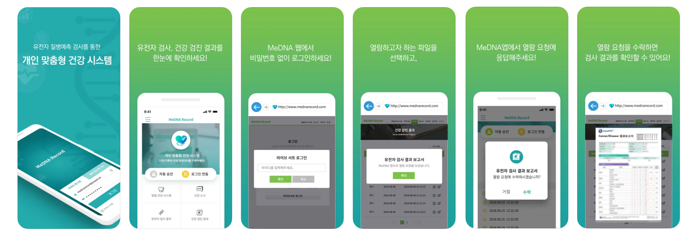

<blockquote>
    

        우리가 매번 받는 건강 검진 결과를 한곳에서 저장하고 관리 하여 나의 건강 상태가 어떻게 변하여 왔고 앞으로 어떤 일이 일어날까를 예측관리 할 수 있습니다. 
        MeDNA는 유전자 질병 예측 검사 결과를 함께 보면서 나의 건강 검진 결과와 비교하여 앞으로 일어날 수 있는 질병을 예측하여 적극예방하고 우리집안에 내려오는 질병을 막기 위해 생활환경을 개선할 수 있도록 나침반 역할을 합니다.
    

</blockquote>

<b># 앱 아이콘</b>

    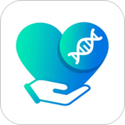

<b># 앱 설명</b>
<ul>
    <li>유전자 질병 예측 검사 결과지 보기</li>
    <li>건강검진 결과지 보기</li>
    <li>App Store 배포</li>
</ul>

<b># 개발 정보</b>
<ul>
    <li>개발언어: Swift</li>
    <li>개발스택: UIKit, Storyboard, AutoLayout, Alamofire, RESTful API, Remote Push</li>
    <li>소스관리: SVN</li>
</ul>

    

  

    2. Tcurity 
    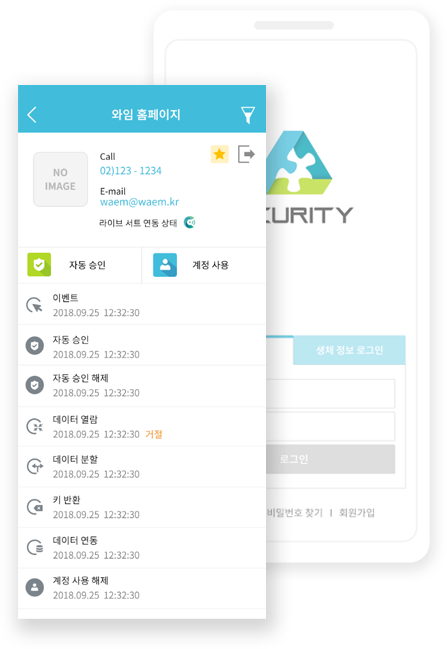

<blockquote>
    

        티큐리티는 데이터를 분할하여 2곳 이상으로 나누어 보관하고 데이터 사용 시 모든 보안 승인자에게 복원 승인을 수락 받아야 사용이 가능합니다.
    

</blockquote>

<b># 앱 설명</b>
<ul>
    <li>포렌식복원이 불가능한 보안</li>
    <li>정보를 최소단위로 분해</li>
    <li>원래의 정보로 복원할 수 없도록 함</li>
    <li>분할된 정보 중 일부분이 없거나 복원 절차가 틀린 경우 복원 불가</li>
    <li><u style="color:red"><i>앱을 출시하지 않음</i></u> (참고: <a href="https://waem.kr/service-grid-with-normal-images">https://waem.kr/service-grid-with-normal-images</a>)</li>
</ul>

<b># 개발 정보</b>
<ul>
    <li>개발언어: Swift</li>
    <li>개발스택: UIKit, Storyboard, AutoLayout, Alamofire, RESTful API, Remote Push</li>
    <li>소스관리: SVN</li>
</ul>

    3. LiveCert 
    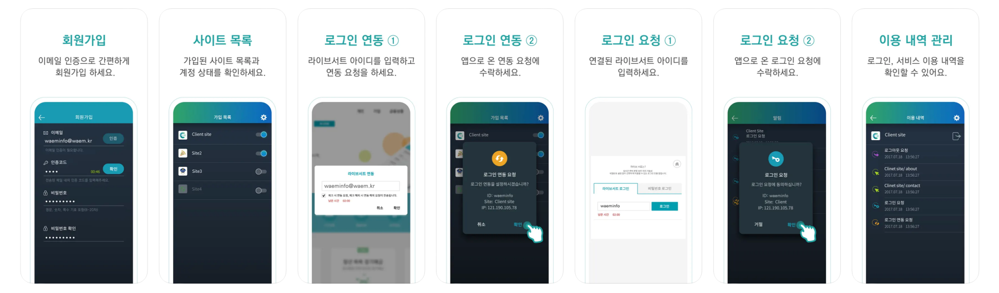

<b># 앱 아이콘</b>

    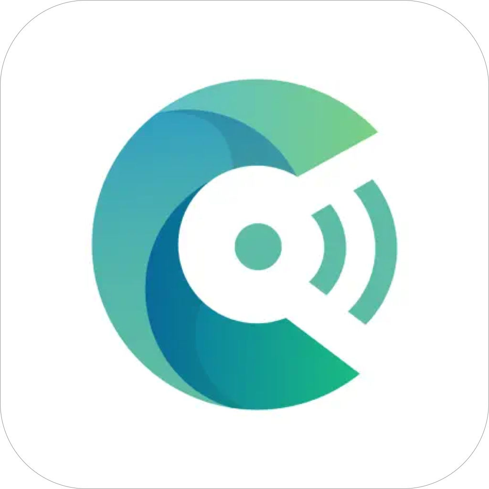

<b># 앱 설명</b>
<ul>
    <li>로그인 연동</li>
    <li>​실시간 로그인​</li>
    <li>계정 잠금</li>
    <li>실시간 로그아웃​</li>
    <li>이용 내역 관리</li>
    <li>소스관리: SVN</li>
    <li><u style="color:red"><i>현재 앱이 정상 동작하지 않음</i></u></li>
</ul>

<b># 개발 정보</b>
<ul>
    <li>개발언어: Swift</li>
    <li>개발스택: UIKit, Storyboard, AutoLayout, Alamofire, RESTful API, Remote Push</li>
    <li>소스관리: SVN</li>
</ul>

    

  

    <a id="personal_projects">- Personal Projects</a>

    1. 집家 (집가) 
    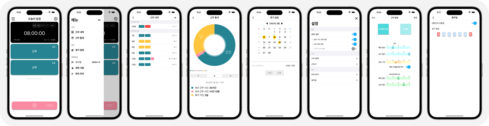

<blockquote>
    

        열심히 일한 당신, 이제는 퇴근 할 때! 
        무의미한 업무 연장은 이제 그만! 집중적으로 일하고 신나게 퇴근하자!  
        이제 퇴근시간은 잊어버리세요. 지금부터 '집家'가 알려드립니다.
    

</blockquote>

<b># 앱 아이콘</b>

    

<b># 앱 설명</b>
<ul>
    <li>근무 일정을 설정하면 퇴근을 미리미리 알려줍니다.</li>
    <li>근무 내역을 기록할 수 있고 주/월/년 단위로 근무 통계를 볼 수 있습니다.</li>
    <li>휴가 일정을 관리할 수 있으며 일정에 대한민국 공휴일을 적용할 수 있습니다.</li>
    <li>경력도 관리해 줍니다.</li>
    <li>현재 App Store에 배포되어있습니다.</li>
</ul>

    <a href="https://clyksb0731.github.io/portfolio/zipga">
        앱 정보 더보기..
    </a>

<b># 개발 정보</b>
<ul>
    <li>개발언어: Swift</li>
    <li>개발스택: UIKit, AutoLayout, Realm, Alamofire, RESTful API, Charts</li>
    <li>소스관리: Git, Github</li>
</ul>

    
    
    

  

    2. 마이스몰트립 
    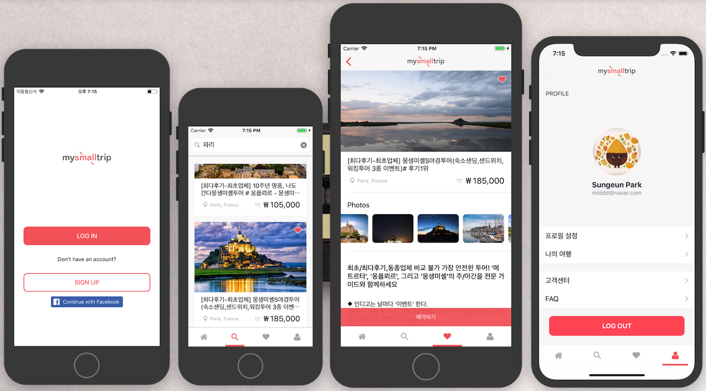

<blockquote>
    

        사진 찍고 오는 여행 No!! 발자국만 찍고 돌고 오는 여행 No!! 
        진정한 여행이란? 현지를 느끼고 오는 것!!! 
        현지 여행의 모든 것을 담은 마이리얼트립의 작은 버전. My Small Trip 입니다.
    

</blockquote>

<b># 앱 설명</b>
<ul>
    <li>마이리얼트립(현재 여행 중개 서비스)의 Small Version</li>
    <li>Fast Campus 팀 프로젝트로서 <a href="https://www.myrealtrip.com">마이리얼트립</a>의 리뉴얼 앱입니다.</li>
</ul>

<b># 개발 정보</b>
<ul>
    <li>개발언어: Swift</li>
    <li>개발스택: UIKit, AutoLayout, Alamofire, RESTful API</li>
    <li>소스관리: Git, Github</li>
</ul>

    
    

  

    <a id="etc">- 기타</a>

    1.

