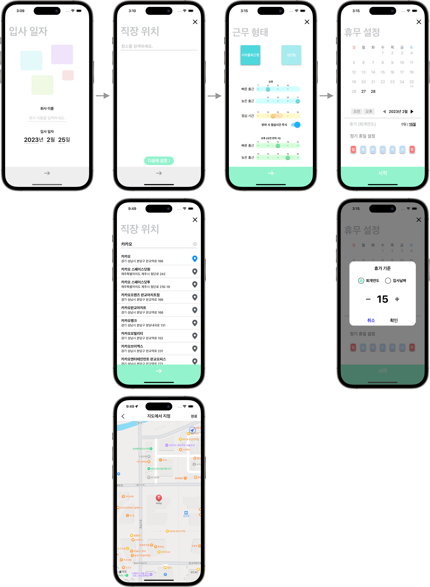

    집家
    

    
    <blockquote>
        열심히 일한 당신, 이제는 퇴근 할 때! 
        무의미한 업무 연장은 이제 그만! 집중적으로 일하고 신나게 퇴근하자! 
        이제 퇴근시간은 잊어버리세요. 지금부터 '집家'가 알려드립니다.
    </blockquote>

    
    

        
        
        
    

 

    지원 연락처
    <blockquote>
    Email: clyksb0731@gmail.com
    </blockquote>

    1. 앱 초기 설정
    
    # 설정 방법

<ol style="font-size:1.1em;font-weight:bold">
    <li>우선 회사 이름과 입사 날짜가 필요해요.</li>
    <li>직장 위치를 지정하세요. 회사 이름뿐만 아니라 주소로도 찾을 수 있어요. 물론 다음에 설정할 수도 있고요.</li>
    <li>출퇴근 형태를 선택하세요. 시차출퇴근형이나 일반적으로 정해진 출퇴근시간 형태로도 선택할 수 있어요. 점심시간을 지정할 수 있고 반차 때 배제하도록 설정할 수도 있어요.</li>
    <li>마지막으로 휴무일을 지정하세요. 일요일과 토욜일같은 정기 휴일을 지정할 수 있어요. 연차휴가도 미리 설정 할 수 있고요. 자 이제 설정을 모두 마치고 시작버튼을 누르면 앱의 주 기능을 담당하는 메인화면으로 넘어갈 거예요.</li>
</ol>
