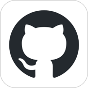
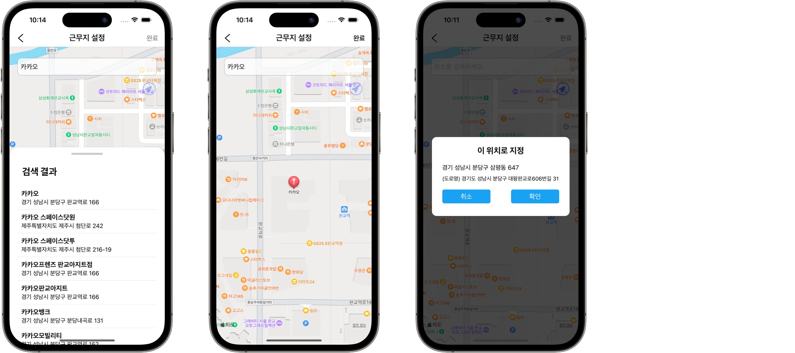

    집家
    

    
    <blockquote>
        열심히 일한 당신, 이제는 퇴근 할 때! 
        무의미한 업무 연장은 이제 그만! 집중적으로 일하고 신나게 퇴근하자! 
        이제 퇴근시간은 잊어버리세요. 지금부터 '집家'가 알려드립니다.
    </blockquote>

    
    

        
        
        
    

 

    지원 연락처
    <blockquote>
    Email: clyksb0731@gmail.com
    </blockquote>

1. 앱 초기 설정

    
    # 설정 방법

<ol class="clyksb_zipga_list">
    <li>우선 회사 이름과 입사 날짜가 필요해요.</li>
    <li>직장 위치를 지정하세요. 회사 이름뿐만 아니라 주소로도 찾을 수 있어요. 물론 다음에 설정할 수도 있고요.</li>
    <li>출퇴근 형태를 선택하세요. 시차출퇴근형이나 일반적으로 정해진 출퇴근시간 형태로도 선택할 수 있어요. 점심시간을 지정할 수 있고 반차 때 배제하도록 설정할 수도 있어요.</li>
    <li>마지막으로 휴무일을 지정하세요. 일요일과 토욜일같은 정기 휴일을 지정할 수 있고 연차 휴가도 미리 예약 할 수 있어요. 설정을 모두 마치고 시작 버튼을 누르면 앱의 주 기능을 담당하는 메인 화면으로 넘어가게 돼요.</li>
</ol> 

    2. 앱 메인

- 메인 화면

    
    # 뷰 설명

<ol class="clyksb_zipga_list">
    <li>평일 메인 화면이예요. 평일엔 오전 오후 모두 근무 시간으로 정해져요. 필요할 땐 추가 근무도 추가 할 수 있어요.</li>
    <li>휴가 때는 오전 오후 휴가로 정해져요. 물론 반차의 경우도 있는데 밑에서 다룰게요.</li>
    <li>휴일도 마찬가지예요. 기본적으로 오전 오후 모두 휴일로 정해지는데 반나절만 휴일인 경우엔 그렇게 설정할 수 있어요. 그 것 역시 밑에서 다룰게요.</li>
</ol> 

- 현황 뷰 in 메인 화면

    
    # 뷰 설명

<ol class="clyksb_zipga_list">
    <li>메인 화면의 검은 뷰 부분을 설명할 거예요. 이 부분을 이제 현황 뷰라고 부를게요. 우선 첫 번째 화면의 현황 뷰는 오늘 하루 남은 근무 시간을 의미해요.</li>
    <li>두 번째 화면의 현황 뷰는 현재까지 진행된 오늘 근무 시간을 의미하고요.</li>
    <li>그리고 마지막 화면의 현황 뷰는 오늘 총 근무 시간 중 현재까지 진행된 비율을 의미해요.</li>
</ol> 

- 반차 근무 혹은 반나절 근무

    
    # 뷰 설명

<ol class="clyksb_zipga_list">
    <li>하루 근무 일정을 반차나 반나절 근무일정으로 설정할 수도 있어요. 우선 오후 반차의 경우인데 오전을 근무 시간으로 오후엔 휴가를 설정하면 돼요.</li>
    <li>다음으로 오전 반차의 경우 오전엔 휴가 오후엔 근무를 설정하면 돼요. 우후엔 근무로 설정되어 있기 때문에 추가 근무도 설정할 수 잇어요. 추가 근무에 대해서는 밑에서 다룰게요.</li>
    <li>휴가대신 휴일을 설정할 수도 있어요. 그런 경우도 있으니까요. 마찬가지로 오전 오후 중 어디든 휴일로 설정할 수 있고 오후 반나절 근무가되면 추가 근무 또한 설정할 수 있어요.</li>
    <li>마지막 뷰에선 추가 근무가 설정된 일정을 볼 수 있어요. 추가 근무에 대해선 밑에서 자세히 다룰게요.</li>
    <li style="list-style:none">* 추가로 '오늘 점심시간 무시 스위치'가 있는데 이 스위치를 활성화하면 점심시간동안 근무 시간이 멈추지 않고 형황 뷰에 계산되어 보여져요.</li>
</ol> 

- 추가 근무

    
    # 뷰 설명

<ol class="clyksb_zipga_list">
    <li>추가 근무를 일정에 추가 할 수 있어요. 뷰 하단에 보이는 추가 근무 버튼을 누르면 언제까지 추가 근무를 할 지 정할 수 있죠. 아! 출근 시간을 정한 후에만 가능하다는 건 잊지마세요.</li>
    <li>오전 오후 일정 중 추가 근무가 설정되면 하단의 버튼은 사라지고 현황 뷰에 추가 근무 시간까지 적용되어 나타나요. 혹시 추가 근무 없이 하루 일정이 지나게 되면 하단에 업무 종료 혹은 추가 근무를 추가할 수 있는 버튼이 나타나게 되는데 그 즉시 업무를 종료하거나 추가 근무를 설정할 수도 있어요. 버튼에 시간도 제안되는데 그대로 하던지 조절 할 수 있어요.</li>
    <li>만약 추가 근무가 설정된 상태에서 오전 오후 근무 시간은 지났고 추가 근무 시간이 지나지 않았을 때에는 하단에 나타나는 '지금 업무 종료' 버튼을 눌러 그 시간에 맞춰 추가 근무 시간을 수정하면서 업무를 종료할 수 있어요.</li>
    <li>마지막으로 추가 근무를 추가한 상태에서 그 추가 근무 시간이 지나도록 업무를 종료하지 않으면 하단에 추가 근무 시간을 변경하거나 현재 설정돼있는 일정으로 업무를 종료하는 버튼이 나타나요. 즉시 업무를 종료할 수 있고 버튼에 제안된 시간으로 추가 근무 시간을 변경할 수도 있어요.</li>
</ol> 

- 일정 수정

    
    # 뷰 설명

<ol class="clyksb_zipga_list">
    <li>일정을 수정할 수 있는 방법은 두 가지가 있어요. 우선 첫 번째로 현황 뷰의 '추가 | 제거' 버튼을 눌러서 오전 오후 그리고 추가 근무까지 추가하거나 제거해서 일정을 만들 수 있어요.</li>
    <li>그리고 두 번째 방법으로는 오전 혹은 오후 일정을 길게 눌러서 근무, 휴가, 휴일 중 정할 수 있어요. 하루 일정의 구조별로 휴가 혹은 휴일을 선택하지 못할 수도 있지만요. 추가 근무도 길게 눌러 수정할 수 있다는 점 잊지 마세요.</li>
</ol> 

    2. 앱 메뉴

- 메뉴 화면

    
    # 뷰 설명

<ol class="clyksb_zipga_list">
    <li>근무 내역을 관리 할 수 있어요.</li>
    <li>근무 시간 통계를 확인할 수 있어요.</li>
    <li>휴가를 관리할 수 있어요.</li>
    <li>입사 날짜를 나타냅니다.</li>
    <li>경력 관리를 할 수 있습니다.</li>
    <li>퇴직 처리를 할 수 있습니다.</li>
</ol> 

- 근무 내역

    
    # 뷰 설명

<ol class="clyksb_zipga_list">
    <li>어제까지 근무 내역을 확인할 수 있어요. 추가할 수 있고 지울 수도 있어요.</li>
    <li>상단 + 버튼을 누르면 입사일부터 어제까지 근무를 추가할 수 있는데 기존 근무 내역은 수정할 수도 있어요.</li>
    <li>선택된 날짜에 대한 일정을 추가 수정 그리고 삭제할 수 있어요.</li>
</ol> 

- 근무 통계

    
    # 뷰 설명

<ul class="clyksb_zipga_list">
    <li>근무 통계는 어제까지 근무 내역에 대한 통계입니다. 주/월/년에 대한 근무 시간 통계를 확인 할 수 있어요.</li>
</ul> 

- 휴가 일정

    
    # 뷰 설명

<ol class="clyksb_zipga_list">
    <li>휴가를 미리 예약하거나 지나간 휴가를 기록할 수 있어요.</li>
    <li>휴가는 1년 단위로 예약 및 기록 할 수 있는데 총 연차 일수 내에서 가능해요. 총 연차 일수와 1년 시작 기준은 앱 설정에서 변경할 수 있어요.</li>
</ol> 

- 경력 사항

    
    # 뷰 설명

<ol class="clyksb_zipga_list">
    <li>현 회사에서 이전 회사 순으로 나열하고 있어요. 이전 회사들을 추가할 수 있고 삭제할 수도 있고요. 각 회사별로 근무 내역도 확인할 수 있어요.</li>
    <li>회사 이름과 입사 날짜 그리고 퇴사 날짜를 수정할 수 있어요. 단 현 회사 퇴사 날짜만 빼고요.</li>
    <li>이전 회사를 추가할 수 있는데 입사 날짜 및 퇴사 날짜는 다른 회사와 겹치지 않아야 해요.</li>
</ol> 

- 퇴직 처리

    
    # 뷰 설명

<ol class="clyksb_zipga_list">
    <li>마지막 근무 날을 설정하세요.</li>
    <li>마지막 근무일을 변경할 수도 있어요. 퇴직을 늦추는 거죠.</li>
    <li>혹은 예정된 퇴직을 취소할 수 있어요. 물론 마지막 근무 날이 지난 후라도 퇴직은 취소할 수 있고요.</li>
    <li>퇴직 후 새로운 회사에 입사해서 신규 회사를 설정할 수도 있어요.</li>
</ol> 

    3. 앱 설정

- 설정 화면

    
    # 뷰 설명

<ol class="clyksb_zipga_list">
    <li>알림을 설정할 수 있어요.</li>
    <li>근무 형태를 정할 수 있어요.</li>
    <li>근무지를 설정할 수 있어요.</li>
    <li>연차 휴가 일수 및 연차휴가 기준을 정할 수 있어요.</li>
    <li>휴무일을 설정할 수 있어요.</li>
</ol> 

- 알림 설정

    
    # 뷰 설명

<ol class="clyksb_zipga_list">
    <li>출근 시간 설정 알림을 설정할 수 있어요. 정기 휴일이 아닌 날엔 출근 시간을 설정하라는 알림을 받을 수 있죠. 그런데 근무 형태가 일반형일 경우엔 출근 시간이 고정되어 있어서 해당 알림 대신 그 날 스케줄을 확인하라는 스케줄 확인 알림으로 설정할 수 있어요.</li>
    <li>업무시간이 끝났을 때 혹은 일정 시간 전에 업무 종료에 대해 알림을 받을 수 있어요. 업무가 끝나기 30분전부터 업무가 끝나는 그 시간 정각까지 총 네 번의 알림을 받을 수 있죠.</li>
    <li>근무지 근처에 가면 알림을 받을 수 있어요. 그 날의 일정을 확인하고 조정하라는 취지죠. 근처에 가면 받는 알림이기 때문에 잠시 외출 후에 돌아올 때도 다시 받을 수 있다는 점은 잊지 마세요.</li>
</ol> 

- 근무 형태

    
    # 뷰 설명

<ol class="clyksb_zipga_list">
    <li>근무 형태로 시차출퇴근형을 선택한다면 출근시간과 늦은 출근 시간을 오전 오후 출근에 대해 설정할 수 있고 점심시간을 설정할 수 있어요. '반차 시 점심시간 무시' 설정은 메인 화면의 '오늘 점심시간 무시' 설정값이 돼요.</li>
    <li>근무 형태로 일반형을 선택한다면 오전 오후 출근시간을 고정으로 설정하게 돼요. 이 근무 형태는 출근시간을 따로 설정할 필요가 없어서 앱을 실행한 후 메인 화면 현황 뷰에서 바로 진행 상황을 확인 할 수 있죠. 이 근무 형태 역시 점심시간을 설정할 수 있어요.</li>
</ol> 

- 근무지 설정

    
    # 뷰 설명

<ol class="clyksb_zipga_list">
    <li>회사 이름 혹은 주소로 검색할 수 있어요.</li>
    <li>해당 위치를 지도에서 볼 수 있어요.</li>
    <li>지도를 길게 눌러서 해당 위치를 선택할 수 있어요.</li>
</ol> 

- 연차 휴가

    
    # 뷰 설명

<ul class="clyksb_zipga_list">
    <li>총 연차 일수와 휴가 기준을 설정할 수 있어요. 휴가 기준은 1년의 시작을 어떻게 볼 것인가인데 회계연도는 1월 1일부터 1년을 본다는 것이고 입사 날짜는 말 그대로 입사 날짜 부터 1년을 본다는 거예요.</li>
</ul> 

- 휴무일

    
    # 뷰 설명

<ol class="clyksb_zipga_list">
    <li>정기 휴일을 지정할 수 있어요. 보통은 토요일과 일요일이 정기 휴일이죠.</li>
    <li>대한민국 공휴일을 휴무일로 설정할 수 있어요. 그렇게 설정하면 휴가 일정에서도 대한민국 공휴일은 배제돼요. 휴무일을 휴가로 지정할 필요는 없으니까요.</li>
</ol> 